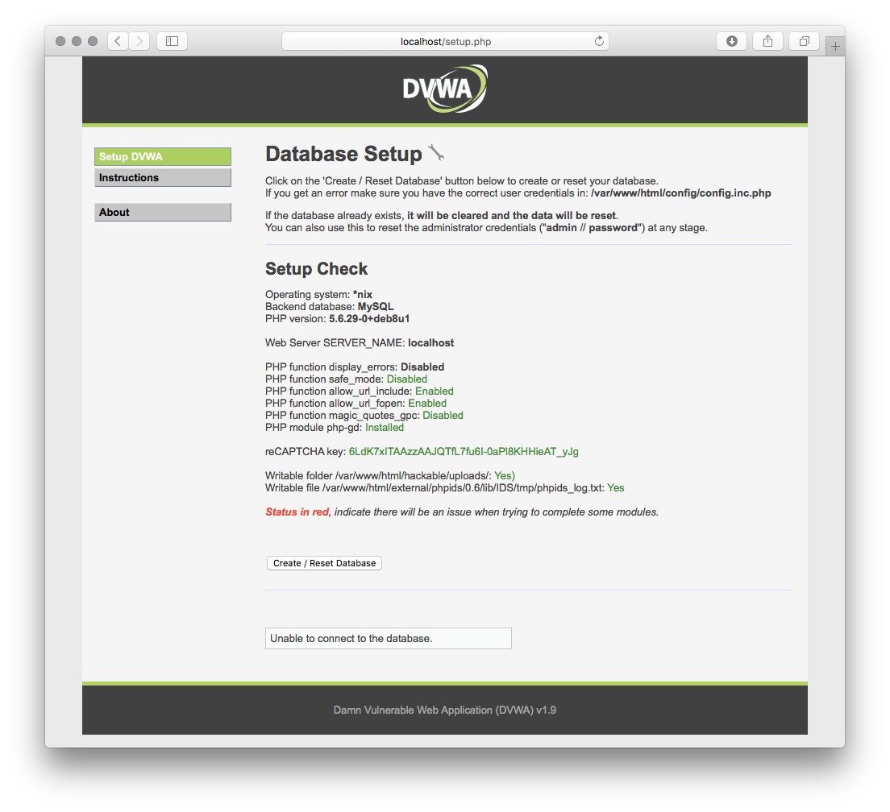

# Damn Vulnerable Web Application Docker container
[](https://hub.docker.com/r/vulnerables/web-dvwa/)


Damn Vulnerable Web Application (DVWA) is a PHP/MySQL web application that is damn vulnerable. Its main goal is to be an aid for security professionals to test their skills and tools in a legal environment, help web developers better understand the processes of securing web applications and to aid both students & teachers to learn about web application security in a controlled class room environment.

The aim of DVWA is to practice some of the most common web vulnerability, with various difficultly levels, with a simple straightforward interface. Please note, there are both documented and undocumented vulnerability with this software. This is intentional. You are encouraged to try and discover as many issues as possible.

## Run this image

To run this image you need [docker](http://docker.com) installed. Just run the command:

    docker run --rm -it -p 80:80 vulnerables/web-dvwa

And wait until it download the image and start it, after that you can see the image running in your local machine:



Just click on the ```Create / Reset database``` button and it will generate any aditional configuration needed.

## Credentials

  * Username: admin
  * Password: password

## About DVWA

You can visit DVWA [official website](http://www.dvwa.co.uk/) and official [github repository](https://github.com/ethicalhack3r/DVWA) if you want more information


### Disclaimer

This or previous program is for Educational purpose ONLY. Do not use it without permission. The usual disclaimer applies, especially the fact that me (opsxcq) is not liable for any damages caused by direct or indirect use of the information or functionality provided by these programs. The author or any Internet provider bears NO responsibility for content or misuse of these programs or any derivatives thereof. By using these programs you accept the fact that any damage (dataloss, system crash, system compromise, etc.) caused by the use of these programs is not opsxcq's responsibility.
